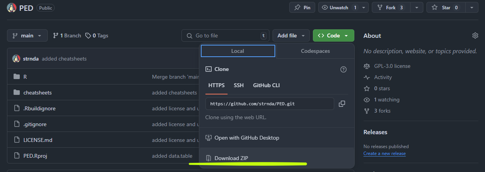
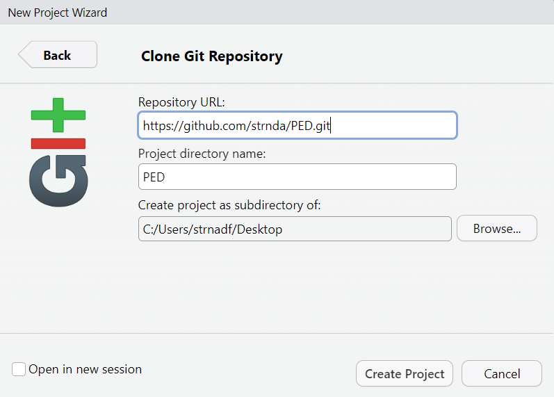

<!-- README.md is generated from README.Rmd. Please edit that file -->

# Presentation of Environmeltal Data

Collection of scripts and data for the **PED** class

**Valid (2025-10-1)
[Datacamp](https://www.datacamp.com/groups/shared_links/015a2cd543ee041a76271b79bb5fabcffdd2218af701771165671a3ba4df0696)
invite link**

## How to get the content of tis repo to your local machine

- without git:

``` r
## using R

if (!require(curl)) {
  install.packages(curl)
}
require(curl)


## Download the archive with all files in the repository
## (destfile is location of the future file)
dir.create(path = "./data/",
           showWarnings = FALSE,
           recursive = TRUE)
curl_download(url = "https://github.com/strnda/PED/archive/refs/heads/main.zip", 
              destfile = "./data/test.zip")

## unzip the archive
unzip(zipfile = "./data/test.zip",
      overwrite = TRUE, 
      exdir = "./data/")
```

Or manualy download the archive… 

- with git

``` bash
## using bash (git) commands
git clone https://github.com/strnda/PED.git
```

Or clone it manually via Rstudio ide interface: navigate to “New
Project” \> “Version Control” \> “git” and paste the repo URL  


# Content of the repository

- In the **R** folder you can find important scripts named in logical
  order (1 - data import, 2 - basic data analysis, etc…)  
- **cheatshees** folder contains cheat sheets that can be useful in your
  future endeavors
